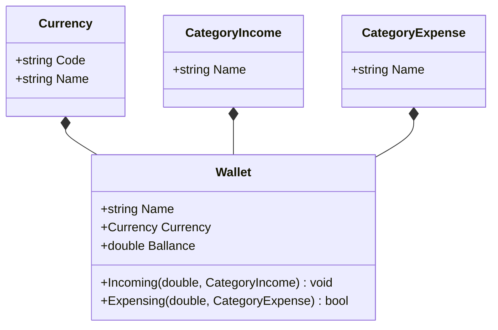

# Диаграмма классов модели данных

```mermaid
classDiagram 
    class Currency{
      +string Code
      +string Name
    }
    class Wallet{
        +string Name
        +Currency Currency
        +double Ballance
        +Incoming(double, CategoryIncome) void
        +Expensing(double, CategoryExpense) bool
    }
    Currency *-- Wallet

    class CategoryIncome{
        +string Name
    }
    CategoryIncome *-- Wallet

    class CategoryExpense{
        +string Name
    }
    CategoryExpense *-- Wallet
```
