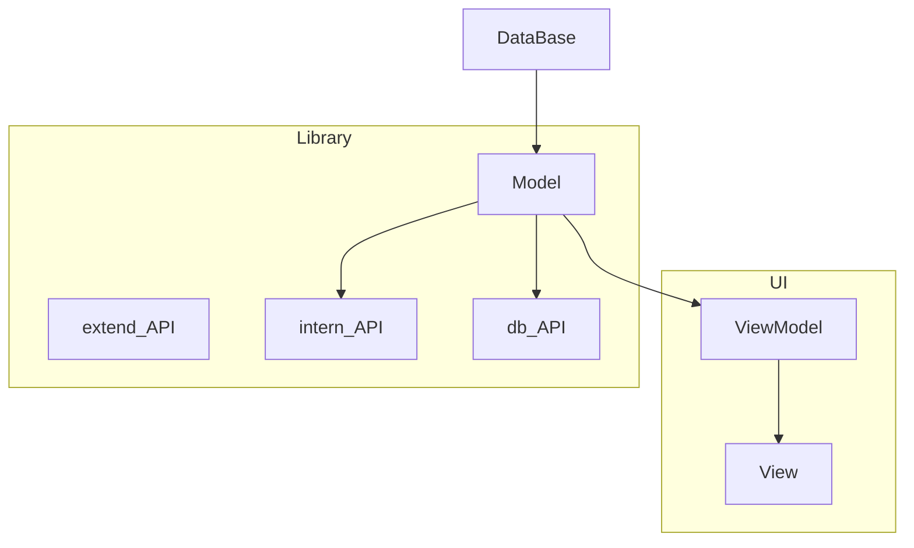
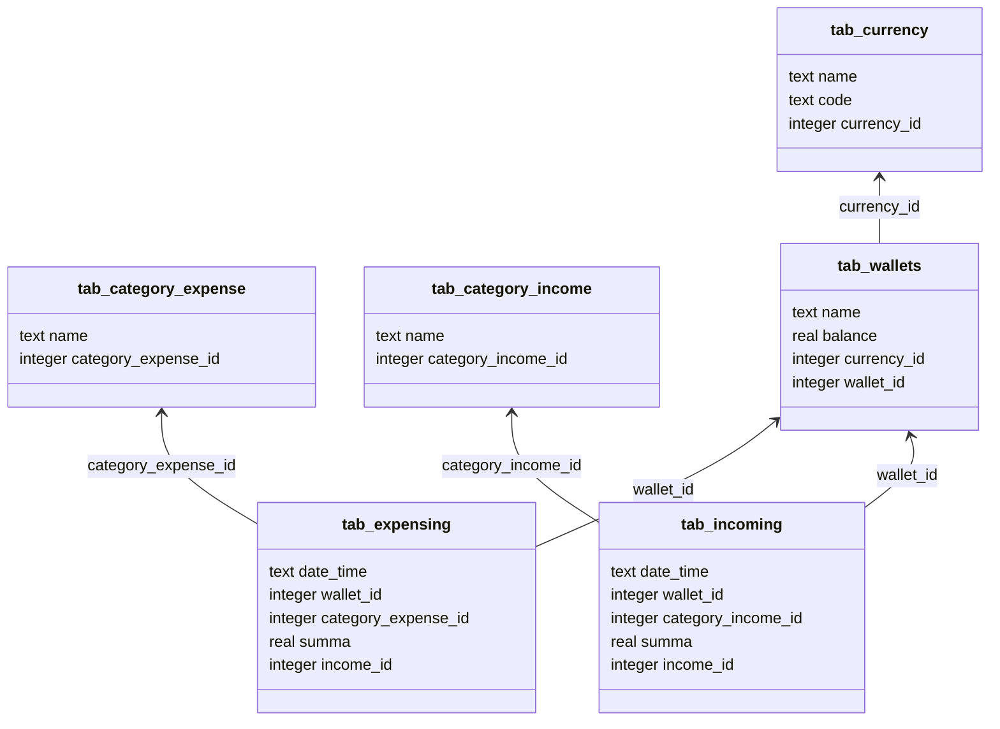
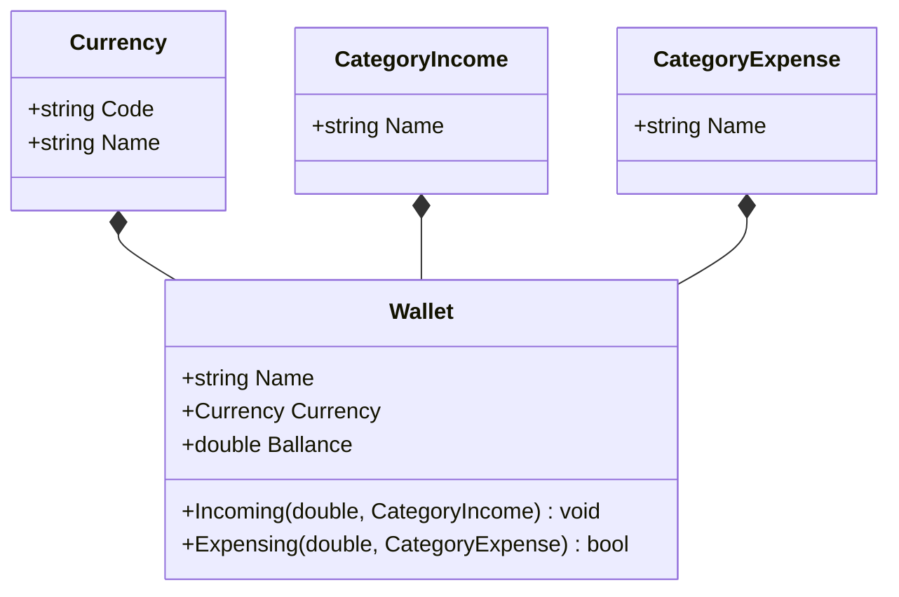

# PersonalFinanceAccounting

## Словарь названий сущностей
валюта - currency

доход - income

расход - expense

кошелёк - wallet

остаток - balance

## Диаграмма модулей

## Диаграмма таблиц БД

## Диаграмма классов модели данных

